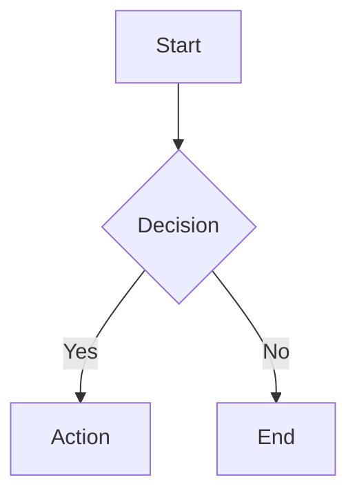

# #️⃣ HashMark
> **The zero-dependency, serverless markdown editor that lives in your URL.**

HashMark is a powerful, feature-rich markdown editor that runs entirely in your browser. It uses the URL hash to store your document, meaning you can share "files" just by sending a link. No database, no accounts, no servers—just you and the client.

[](https://danielcregg.github.io/hashmark/)
[](https://danielcregg.github.io/hashmark/)
[](https://danielcregg.github.io/hashmark/)

**🚀 Try it now:** [https://danielcregg.github.io/hashmark/](https://danielcregg.github.io/hashmark/)
**✨ View Sample:** [Click here to see a feature-rich example document](https://danielcregg.github.io/hashmark/#TVPLUtswFN3rK06ABXiwp00fCzrAFFIKU-h0CB3aEiDCvrHVKFKQriGZOOz6BXTZDpv2x_oFfEJHdhm6su498jnnSkeLOCad2hGBLXalLw6kG7Zwf3f7U4ijQnmQYeUImU3LERmG8vBsHWVQBlwQPh7uJ4iiL-QsMsnyQnpKUJee3BW5JIqEWFzE_d3339ghyaUjD8mQeKulSSmgi3ia4FClBXasG0lmZXIRRVtWZ1G0ivM9llql56u4uemyU0PiwtkyL25uVtHfM1oZwrbNqC_EBra0TYeXpeWgo7W9xtSWYcJC5YVWecFQo7F1LMNAZlArKmuSxkk7wYHkAt1yHDZh-Z08ok8ropFZw9IbrGOUnrWXRK20JpaWRE8ZPn9y1lNmwFPQ2SyenLXnyCZYR2_gZDrr-UvHs95Yzeez9jz8U6s9S9CdGpYT7D64C7P3-_2v8kr61Kkxi0Fp0uAQBWltl1cwE0BqjbeaEm3z5YXdAKzi2DqdtRZWXol5oGgknifoKJk7OfJYPiA3kipbCfCoWYvcyXGBo44AgNcnXZaOTxHHG9ia7XkoxrV1Q2XyzXm9ZStg1WfyFbZP3jqS3Dr9D3hvK3ROOnRR5k2703A9OnqR4EheaPKieogEKnRZculRiQprcRzj4SOqJk8dGntU-PPjW93bkZ7_K7uUNjRNo9Z5mWDPMDmZsroi7CvPXsQ4mZxiO9h-DHbo4hTdQro60__qD84OFG8KEcdxQ8luGg5kakvnSQ9a4mmCN5licHguTBMW7QTbWqVDRNH93e2vhjSKRLhqMln9bLQywxBJiYFTZLKW-As)

---

## ✨ Features

### Editor & Preview
| Feature | Description |
|---------|-------------|
| 📝 **Full Markdown** | Complete GitHub-Flavored Markdown (GFM) support |
| 👁️ **Live Preview** | Real-time rendering as you type |
| 🔄 **Three View Modes** | Edit, Split, or Preview modes |
| 💾 **Auto-Save** | Changes saved automatically with visual indicator |
| 📊 **Word Count** | Live word and character count in status bar |

### Formatting Toolbar (Sidebar)
| Button | Function | Shortcut |
|--------|----------|----------|
| **B** | Bold text | `Ctrl+B` |
| *I* | Italic text | `Ctrl+I` |
| `</>` | Inline code | — |
| 🔗 | Insert link | `Ctrl+K` |
| H1/H2/H3 | Headings | — |
| • / 1. / ☐ | Lists (bullet, numbered, task) | — |
| 🖼️ | Insert image | — |
| ▦ | Insert table | — |
| " | Blockquote | — |
| ― | Horizontal rule | — |
| 📊 | **Mermaid diagrams** (8 templates) | — |
| { } | **Code blocks** (16 languages) | — |

### Diagram Support
Click the **📊 Diagram** button to insert pre-built templates:
- 🔀 Flowchart
- ↔️ Sequence Diagram
- 📦 Class Diagram
- 🔄 State Diagram
- 🗃️ ER Diagram
- 📅 Gantt Chart
- 🥧 Pie Chart
- 🧠 Mind Map

### Code Block Support
Click the **{ } Code** button to insert syntax-highlighted blocks:
- JavaScript, TypeScript, Python, Java
- C, C++, C#, Go, Rust
- HTML, CSS, SQL, Bash, JSON
- Ruby, PHP

### Advanced Rendering
| Feature | Example |
|---------|---------|
| **Math Equations** | `$E = mc^2$` or `$$\sum_{i=1}^n x_i$$` |
| **Syntax Highlighting** | Automatic for 180+ languages |
| **Emoji Shortcodes** | `:smile:` → 😄, `:rocket:` → 🚀 |
| **Mermaid Diagrams** | Lazy-loaded for performance |

### Toolbar Actions
| Button | Function |
|--------|----------|
| ↶ / ↷ | Undo / Redo (`Ctrl+Z` / `Ctrl+Y`) |
| ☀️ 🌙 📜 | Theme toggle (Light / Dark / Sepia) |
| 📄 New | Open fresh document in new tab |
| 💾 | Download as `.md` file |
| 📋 | Copy rendered HTML |
| 🖨️ | Print / Export to PDF |
| 📱 | Generate QR code for sharing |
| 📤 | Share URL (copy to clipboard) |
| ⛶ | Fullscreen mode (`F11`) |

### Sharing & Collaboration
- 🔗 **URL-based sharing** — Document encoded in URL hash
- 🗜️ **Smart compression** — Deflate compression for compact URLs
- 📱 **QR Code generation** — Scan to share on mobile
- 📤 **Native sharing** — Uses mobile share sheet when available
- 💾 **Dual persistence** — Stored in localStorage AND URL

### Theming
Three beautiful themes that persist across sessions:
- ☀️ **Light** — Clean, bright interface
- 🌙 **Dark** — Easy on the eyes
- 📜 **Sepia** — Warm, paper-like feel

---

## 🚀 Quick Start

1. **Open** the editor at [danielcregg.github.io/hashmark](https://danielcregg.github.io/hashmark/)
2. **Write** your markdown in the editor pane
3. **Preview** using Split or Preview mode
4. **Share** by clicking 📤 Share or 📱 QR Code
5. **Export** as `.md`, HTML, or PDF

---

## ⌨️ Keyboard Shortcuts

| Shortcut | Action |
|----------|--------|
| `Ctrl+B` | Bold |
| `Ctrl+I` | Italic |
| `Ctrl+K` | Insert link |
| `Ctrl+S` | Save |
| `Ctrl+Z` | Undo |
| `Ctrl+Y` / `Ctrl+Shift+Z` | Redo |
| `Tab` | Insert 2 spaces |
| `F11` | Toggle fullscreen |
| `Escape` | Exit fullscreen |

---

## 📖 Markdown Support

### Text Formatting
```markdown
**Bold**, *italic*, ***bold italic***
~~Strikethrough~~, `inline code`
```

### Headings
```markdown
# H1  ## H2  ### H3  #### H4  ##### H5  ###### H6
```

### Lists
```markdown
- Bullet item
1. Numbered item
- [ ] Task item
- [x] Completed task
```

### Links & Images
```markdown
[Link text](https://example.com)

```

### Code Blocks
````markdown
```javascript
console.log('Hello, World!');
```
````

### Tables
```markdown
| Header 1 | Header 2 |
|----------|----------|
| Cell 1   | Cell 2   |
```

### Math (KaTeX)
```markdown
Inline: $E = mc^2$
Block: $$\int_0^\infty e^{-x^2} dx = \frac{\sqrt{\pi}}{2}$$
```

### Mermaid Diagrams
````markdown

````

### Emoji Shortcodes
```markdown
:smile: :rocket: :fire: :thumbsup: :heart:
```

---

## 🛠️ Technical Details

| Component | Technology |
|-----------|------------|
| Markdown Parser | [Marked.js](https://marked.js.org/) v11.1.1 |
| Syntax Highlighting | [Highlight.js](https://highlightjs.org/) v11.9.0 |
| Math Rendering | [KaTeX](https://katex.org/) v0.16.9 |
| Diagrams | [Mermaid](https://mermaid.js.org/) v10 (lazy-loaded) |
| QR Codes | [QRious](https://github.com/neocotic/qrious) v4.0.2 |
| Compression | Native CompressionStream API (deflate-raw) |
| Storage | localStorage + URL hash |
| Hosting | GitHub Pages (static) |

---

## 💡 Pro Tips

- Start your document with `# Title` to set the browser tab title
- Use **Split** mode for the best editing experience
- Your theme and view mode preferences are remembered
- Click outside modals to close them
- QR codes work offline once generated
- Long documents? The URL still works—compression is efficient!

---

## 📋 Use Cases

- 📚 Technical documentation
- 📰 Blog posts and articles
- 📋 Meeting notes and agendas
- 📦 Project README files
- 📓 Personal journals
- 💻 Code tutorials
- ✅ Quick notes and checklists
- 📊 Diagrams and flowcharts

---

## 🤝 Contributing

Contributions are welcome! This is a single-file application—all code lives in `index.html`.

---

## 📄 License

MIT License — feel free to use, modify, and share.

---

<p align="center">
  Made with ❤️ and JavaScript<br>
  <a href="https://danielcregg.github.io/hashmark/">Try it now →</a>
</p>
